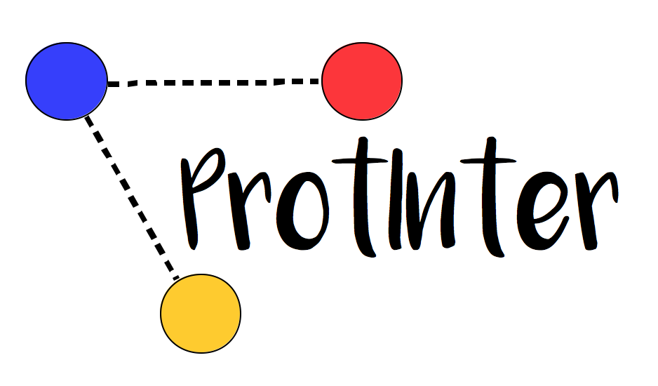

[](https://doi.org/10.5281/zenodo.14851671)




# ProtInter : Protein interaction calculator

**ProtInter** is a tool designed to calculate non-covalent interactions of a single chain protein in a `.pdb` file.

## How to install

```bash
uv pip install git+https://git@github.com:maxibor/protinter.git@master
```

or

```bash
git clone https://github.com/maxibor/protinter.git
cd protinter
uv pip install .
```

## Example

```bash
uv run protinter --hydrophobic -csv ./data/1bta.pdb  
```

```txt
uv run protinter --hydrophobic -csv ./data/1bta.pdb  
 ----------------------------------------------- 
| Hydrophobic Interactions                      |
|-----------------------------------------------|
| RES1 | idRES1 | RES2 | idRES2 | dist(Angstrom)|
| ALA  | 3      | LEU  | 49     | 004.99        |
| ALA  | 3      | LEU  | 51     | 004.92        |
| ILE  | 5      | ILE  | 10     | 004.43        |
| ILE  | 5      | LEU  | 16     | 004.51        |
| ILE  | 5      | LEU  | 20     | 004.74        |
| ILE  | 5      | LEU  | 51     | 004.53        |
| ILE  | 5      | TRP  | 53     | 004.28        |
| ILE  | 10     | LEU  | 16     | 004.84        |
| ILE  | 10     | LEU  | 62     | 004.22        |
| ILE  | 13     | LEU  | 16     | 004.83        |
| ILE  | 13     | VAL  | 70     | 004.88        |
| LEU  | 16     | LEU  | 20     | 004.64        |
| LEU  | 16     | TRP  | 53     | 004.00        |
| LEU  | 16     | ALA  | 67     | 004.83        |
| LEU  | 16     | VAL  | 70     | 004.80        |
| LEU  | 20     | LEU  | 24     | 004.62        |
| LEU  | 20     | LEU  | 26     | 004.93        |
| LEU  | 20     | TYR  | 30     | 004.59        |
| LEU  | 20     | LEU  | 37     | 004.91        |
| LEU  | 20     | LEU  | 51     | 003.89        |
| LEU  | 20     | TRP  | 53     | 004.95        |
| LEU  | 20     | VAL  | 70     | 004.24        |
| LEU  | 20     | PHE  | 74     | 004.95        |
| LEU  | 24     | LEU  | 26     | 004.90        |
| LEU  | 24     | LEU  | 37     | 004.03        |
| LEU  | 24     | LEU  | 41     | 004.82        |
| LEU  | 24     | VAL  | 45     | 004.92        |
| LEU  | 24     | LEU  | 49     | 004.94        |
| LEU  | 24     | PHE  | 74     | 004.54        |
| LEU  | 26     | PRO  | 27     | 004.61        |
| LEU  | 26     | TYR  | 30     | 003.84        |
| LEU  | 26     | LEU  | 37     | 004.71        |
| LEU  | 26     | TRP  | 44     | 004.90        |
| LEU  | 26     | VAL  | 45     | 004.07        |
| PRO  | 27     | TYR  | 29     | 003.90        |
| PRO  | 27     | TRP  | 44     | 004.87        |
| TYR  | 30     | ALA  | 36     | 004.37        |
| TYR  | 30     | LEU  | 37     | 003.88        |
| LEU  | 34     | LEU  | 37     | 004.66        |
| LEU  | 34     | VAL  | 70     | 004.68        |
| LEU  | 34     | VAL  | 73     | 003.74        |
| LEU  | 37     | LEU  | 41     | 004.48        |
| LEU  | 37     | VAL  | 70     | 004.36        |
| LEU  | 37     | VAL  | 73     | 004.51        |
| LEU  | 37     | PHE  | 74     | 004.94        |
| TRP  | 38     | LEU  | 41     | 004.78        |
| TRP  | 38     | VAL  | 73     | 004.68        |
| TRP  | 38     | ALA  | 77     | 004.71        |
| LEU  | 41     | VAL  | 45     | 004.91        |
| LEU  | 41     | TYR  | 47     | 004.45        |
| LEU  | 41     | LEU  | 49     | 004.91        |
| LEU  | 41     | VAL  | 73     | 004.43        |
| LEU  | 41     | PHE  | 74     | 004.69        |
| LEU  | 41     | ALA  | 77     | 003.71        |
| LEU  | 41     | ILE  | 84     | 004.68        |
| TRP  | 44     | VAL  | 45     | 004.67        |
| VAL  | 45     | TYR  | 47     | 004.43        |
| VAL  | 45     | LEU  | 49     | 004.40        |
| TYR  | 47     | PRO  | 48     | 004.59        |
| TYR  | 47     | LEU  | 49     | 004.63        |
| TYR  | 47     | ILE  | 84     | 004.04        |
| LEU  | 49     | VAL  | 50     | 004.92        |
| LEU  | 49     | PHE  | 74     | 004.72        |
| LEU  | 49     | ILE  | 84     | 004.52        |
| VAL  | 50     | ILE  | 87     | 004.85        |
| LEU  | 51     | TRP  | 53     | 004.46        |
| LEU  | 51     | LEU  | 71     | 004.12        |
| LEU  | 51     | PHE  | 74     | 004.98        |
| LEU  | 51     | ILE  | 84     | 004.17        |
| LEU  | 51     | ILE  | 86     | 004.19        |
| TRP  | 53     | PHE  | 56     | 004.73        |
| TRP  | 53     | ALA  | 67     | 004.95        |
| TRP  | 53     | VAL  | 70     | 004.96        |
| TRP  | 53     | LEU  | 71     | 004.17        |
| TRP  | 53     | PHE  | 74     | 004.73        |
| TRP  | 53     | LEU  | 88     | 004.71        |
| PHE  | 56     | ALA  | 67     | 003.65        |
| PHE  | 56     | LEU  | 71     | 004.21        |
| PHE  | 56     | LEU  | 88     | 004.24        |
| VAL  | 70     | PHE  | 74     | 004.75        |
| LEU  | 71     | PHE  | 74     | 004.73        |
| LEU  | 71     | ILE  | 86     | 004.78        |
| LEU  | 71     | LEU  | 88     | 004.83        |
| PHE  | 74     | ILE  | 84     | 004.37        |
| PHE  | 74     | ILE  | 86     | 004.86        |
| ALA  | 77     | ILE  | 84     | 003.69        |
| ILE  | 84     | ILE  | 86     | 005.00        |
| ILE  | 86     | LEU  | 88     | 004.64        |
|-----------------------------------------------|
| Total: 88   interactions                     |
 -----------------------------------------------
 ```


The above example computes the hydrophobic interactions in `1BTA`, displays the results, and writes them in the file `result_hydrophobic.csv`

## List of interactions available

- hydrophobic interactions
- disulphide bridges
- ionic interactions
- aromatic-aromatic interactions
- aromatic-sulphur interactions
- cation-pi interactions
- hydrogen bonds (use results with caution)

Further informations on the interactions can be found [here](./doc/report.pdf)

## Get help

The help menu of **ProtInter** is accessible with the --help flag.

```bash
Usage: protinter [OPTIONS] PDB

  protinter: Protein interaction calculator
  * Homepage: https://github.com/maxibor/protinter
  * Author: Maxime Borry
  PDB: .pdb entry file

Options:
  --version            Show the version and exit.
  -csv, --csv          Output CSV file
  --within_radius      Return residues that are within distance specified
                       distance (in Angstrom) of each other
  --hydrophobic        compute hydrophobic interactions [a]
  --disulphide         compute disulphide bridges [b]
  --ionic              compute ionic interactions [c]
  --aroaro             compute aromatic-aromatic interactions [d] [e]
  --arosul             compute aromatic-sulphur interactions [f]
  --catpi              compute catio-pi interactions [g]
  --hb1                compute main chain-main chain H-bonds [i] [j]
  --hb2                compute main chain-side chain H-bonds [i] [j]
  --hb3                compute side chain-side chain H-bonds [i] [j]
  --interval INTEGER   minimum interval separation two AA for interaction.
                       Default = 0  [default: 0]
  --a FLOAT            hydrophobic interactions max distance (Angstrom)
                       [default: 5.0]
  --b FLOAT            disulphide bridges max distance (Angstrom)  [default:
                       2.2]
  --c FLOAT            ionic interactions max distance (Angstrom)  [default:
                       6.0]
  --d FLOAT            aromatic-aromatic interactions min distance (Angstrom)
                       [default: 4.5]
  --e FLOAT            aromatic-aromatic interactions max distance (Angstrom)
                       [default: 7.0]
  --f FLOAT            aromatic-sulphur interactions max distance (Angstrom)
                       [default: 5.3]
  --g FLOAT            cation-pi interactions max distance (Angstrom)
                       [default: 6.0]
  --i FLOAT            Donor-acceptor distance cutoff (N and O) (Angstrom)
                       [default: 3.5]
  --j FLOAT            Donor-acceptor distance cutoff (S) (Angstrom)
                       [default: 4]
  --w FLOAT            Distance threshold for within_radius (any atom)
                       (Angstrom)  [default: 4]
  --atommindist FLOAT  Two potentially interacting amino acids are disregarded
                       if two randomly selected atoms of these two amino acids
                       have a distance greater than this value (Angstrom)
                       [default: 30]
  --printsequence      Print the sequence of the protein.
  --help               Show this message and exit.
```

## Contributors

Thanks to everyone who also contributed to making ProtInter!

- [Axel Schmidt](https://github.com/Ax-Sch)

## Cite

If you need to cite ProtInter, you can use the Zenodo record

```
Maxime Borry, & Axel Schmidt. (2025). maxibor/protinter: Protinter 0.9.2 (0.9.2). Zenodo. https://doi.org/10.5281/zenodo.14851671
```

```bibtex
@software{maxime_borry_2025_14851671,
  author       = {Maxime Borry and
                  Axel Schmidt},
  title        = {maxibor/protinter: Protinter 0.9.2},
  month        = feb,
  year         = 2025,
  publisher    = {Zenodo},
  version      = {0.9.2},
  doi          = {10.5281/zenodo.14851671},
  url          = {https://doi.org/10.5281/zenodo.14851671},
}
```